

## 1.研究背景与意义


随着科技的不断发展，深度学习在各个领域中得到了广泛的应用。其中，计算机视觉是深度学习的一个重要应用领域。计算机视觉可以通过对图像或视频的处理和分析，实现对图像中物体的识别、分类、定位等任务。在工业领域中，计算机视觉的应用可以提高生产效率、降低成本、提高产品质量等。

矿车装载状态计数系统是一个在矿山行业中非常重要的应用。在矿山中，矿车是用来运输矿石或其他物料的重要工具。矿车的装载状态对于矿山的生产效率和成本控制有着重要的影响。因此，开发一种能够准确、快速地检测和计数矿车装载状态的系统对于矿山行业具有重要的意义。

传统的矿车装载状态计数方法主要依赖于人工的视觉检测和计数，这种方法存在着许多问题。首先，人工检测和计数需要大量的人力资源，成本较高。其次，人工检测和计数容易受到环境条件、光照条件等因素的影响，导致检测和计数的准确性不高。此外，人工检测和计数速度较慢，无法满足矿山行业对于高效生产的需求。

基于深度学习的计算机视觉方法可以有效地解决传统方法存在的问题。深度学习可以通过对大量数据的学习和训练，自动学习到图像中的特征和模式，并实现对图像的自动处理和分析。因此，基于深度学习的矿车装载状态计数系统可以实现对矿车装载状态的自动检测和计数，提高检测和计数的准确性和速度。

Python作为一种简单易学、功能强大的编程语言，被广泛应用于深度学习领域。Python提供了许多强大的深度学习框架和工具，如TensorFlow、PyTorch等，可以帮助开发者快速搭建和训练深度学习模型。因此，使用Python开发基于深度学习的矿车装载状态计数系统具有较高的可行性和便利性。

本研究的目标是基于深度学习技术，开发一种Python实现的矿车装载状态计数系统，并提供相应的部署教程和源码。该系统可以实现对矿车装载状态的自动检测和计数，提高检测和计数的准确性和速度。通过提供部署教程和源码，可以帮助其他研究者和开发者快速理解和应用该系统，推动矿山行业的智能化和自动化发展。

总之，基于深度学习的矿车装载状态计数系统具有重要的应用价值和研究意义。通过该系统的开发和应用，可以提高矿山行业的生产效率和成本控制，推动矿山行业的智能化和自动化发展。同时，通过提供部署教程和源码，可以促进深度学习技术在计算机视觉领域的应用和推广。

# 2.图片演示
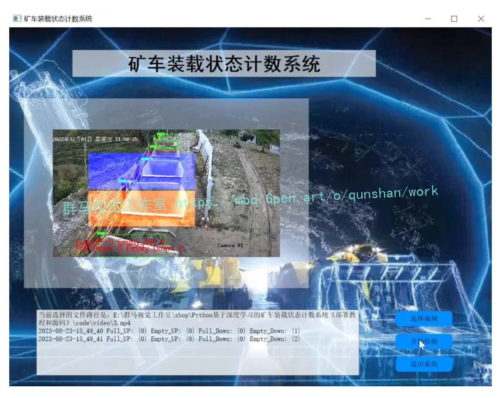

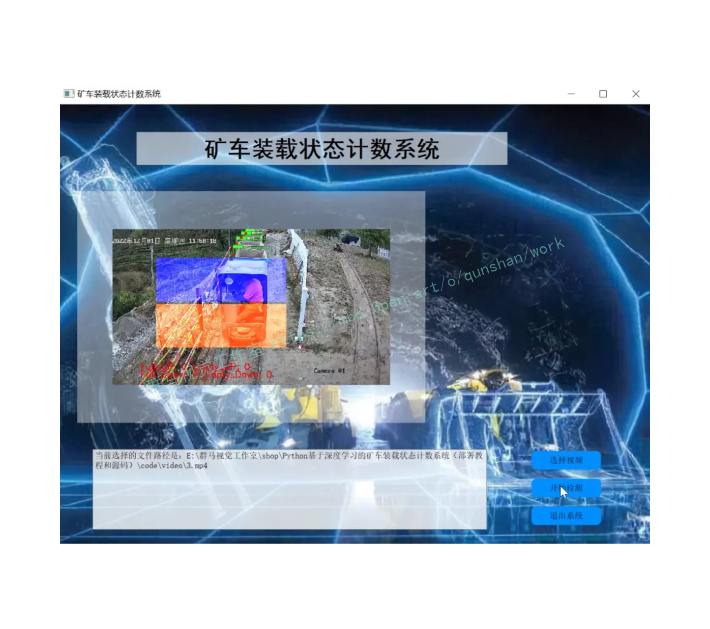

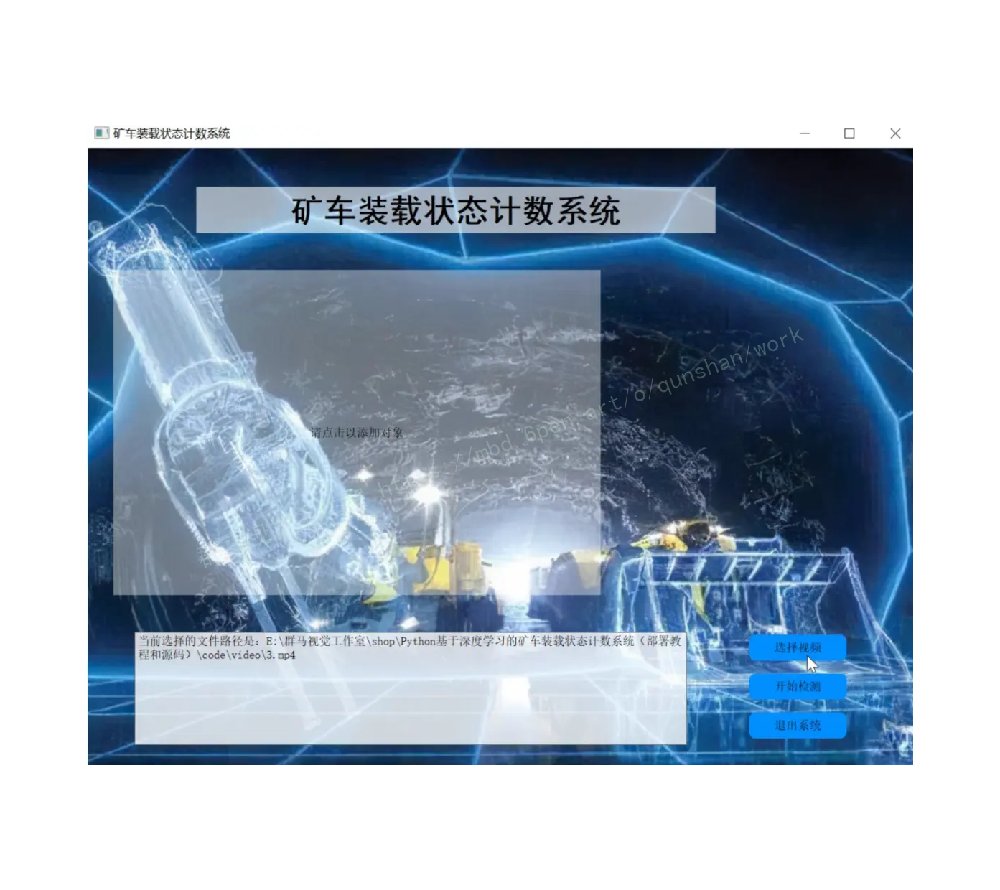

# 3.视频演示
[Python基于深度学习的装载状态矿车统计系统（部署教程和源码）_哔哩哔哩_bilibili](https://www.bilibili.com/video/BV1V8411Q7Ww/?vd_source=ff015de2d29cbe2a9cdbfa7064407a08)

# 4.车辆装载状态的判别
以运输车前进的方向为正方向,在运输车的货物图像上建立坐标系,通过 Canny 边缘检测算法与 So-bel 算法来计算图像灰度的近似梯度,获取车辆侧面外露货物的外形曲线图,并对此建立平面直角坐标系,如图所示。
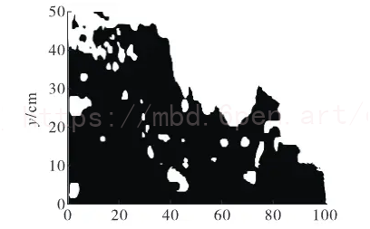
由于货物形状具有不规则性,本文得到在坐标系中货物的大概位置后,以矿车水平及竖直尺寸为依据,使用高斯滤波算法对其去除噪声,使不规则曲线转换成平滑曲线,结果如图所示。
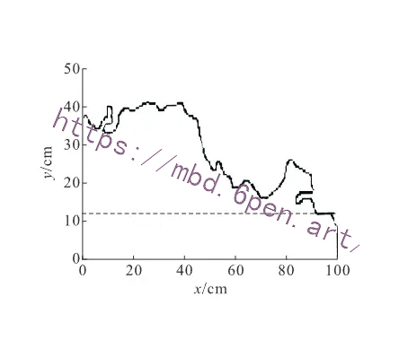
以像素点作为单位,计算车辆货物的满额率。 其中,货物的面积为经过滤波后的平滑曲线与坐标系的x、y 轴所围成区域的面积,前板总成的水平延长线与x、y 轴形成的闭合区域面积为满额面积,即图 中虚线与 x、y 轴所围成区域的面积。 满额率的计算公式为：
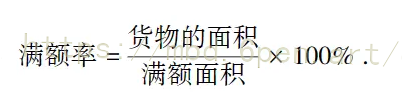


## 5.核心代码讲解

#### 5.1 detector_CPU.py

下面是封装为类后的代码：

```python

class Detector:
    def __init__(self):
        self.img_size = 640
        self.threshold = 0.5
        self.stride = 1

        self.weights = './best.pt'

        self.device = '0' if torch.cuda.is_available() else 'cpu'
        self.device = select_device(self.device)
        model = attempt_load(self.weights, map_location=self.device)
        model.to(self.device).eval()
        model.float()

        self.m = model
        self.names = model.module.names if hasattr(
            model, 'module') else model.names

    def preprocess(self, img):
        img0 = img.copy()
        img = letterbox(img, new_shape=self.img_size)[0]
        img = img[:, :, ::-1].transpose(2, 0, 1)
        img = np.ascontiguousarray(img)
        img = torch.from_numpy(img).to(self.device)
        img = img.float()
        img /= 255.0
        if img.ndimension() == 3:
            img = img.unsqueeze(0)

        return img0, img

    def detect(self, im):
        im0, img = self.preprocess(im)

        pred = self.m(img, augment=False)[0]
        pred = pred.float()
        pred = non_max_suppression(pred, self.threshold, 0.4)

        boxes = []
        for det in pred:
            if det is not None and len(det):
                det[:, :4] = scale_coords(
                    img.shape[2:], det[:, :4], im0.shape).round()

                for *x, conf, cls_id in det:
                    lbl = self.names[int(cls_id)]
                    x1, y1 = int(x[0]), int(x[1])
                    x2, y2 = int(x[2]), int(x[3])

                    xm = x2
                    ym = y2
                    boxes.append((x1, y1, x2, y2, lbl, conf))

        return boxes
```

这个类封装了一个目标检测器，具有以下方法：

- `__init__()`：初始化目标检测器，加载模型和权重。
- `preprocess(img)`：对输入图像进行预处理，包括缩放、转换格式等。
- `detect(im)`：对输入图像进行目标检测，返回检测到的目标框的坐标、类别和置信度。

这个程序文件名为`detector_CPU.py`，它是一个目标检测器的类。以下是该文件的概述：

- 导入了必要的库和模块，包括`torch`、`numpy`、`cv2`等。
- 定义了一个名为`Detector`的类，该类具有以下属性：
  - `img_size`：图像的大小，默认为640。
  - `threshold`：目标检测的置信度阈值，默认为0.5。
  - `stride`：图像的步长，默认为1。
  - `weights`：模型的权重文件路径，默认为'./best.pt'。
  - `device`：设备的选择，默认为GPU设备（如果可用），否则为CPU设备。
  - `m`：加载的模型。
  - `names`：模型中的类别名称。
- 定义了`preprocess`方法，用于对输入图像进行预处理，包括调整大小、转换颜色通道、转换为张量等操作。
- 定义了`detect`方法，用于对输入图像进行目标检测。该方法首先调用`preprocess`方法对图像进行预处理，然后使用加载的模型对图像进行推理，得到预测结果。最后，根据预测结果提取目标框的坐标、类别和置信度，并将其存储在一个列表中返回。

总体而言，这个程序文件实现了一个目标检测器类，可以用于对输入图像进行目标检测，并返回检测到的目标框的信息。

#### 5.2 detector_GPU.py

```python


class Detector:
    def __init__(self):
        self.img_size = 640
        self.threshold = 0.2
        self.stride = 1
        self.weights = './best.pt'
        self.device = '0' if torch.cuda.is_available() else 'cpu'
        self.device = select_device(self.device)
        model = attempt_load(self.weights, map_location=self.device)
        model.to(self.device).eval()
        model.half()
        self.m = model
        self.names = model.module.names if hasattr(model, 'module') else model.names

    def preprocess(self, img):
        img0 = img.copy()
        img = letterbox(img, new_shape=self.img_size)[0]
        img = img[:, :, ::-1].transpose(2, 0, 1)
        img = np.ascontiguousarray(img)
        img = torch.from_numpy(img).to(self.device)
        img = img.half()
        img /= 255.0
        if img.ndimension() == 3:
            img = img.unsqueeze(0)
        return img0, img

    def detect(self, im):
        im0, img = self.preprocess(im)
        pred = self.m(img, augment=False)[0]
        pred = pred.float()
        pred = non_max_suppression(pred, self.threshold, 0.4)
        boxes = []
        for det in pred:
            if det is not None and len(det):
                det[:, :4] = scale_coords(img.shape[2:], det[:, :4], im0.shape).round()
                for *x, conf, cls_id in det:
                    lbl = self.names[int(cls_id)]
                    boxes.append((x[0], x[1], x[2], x[3], lbl, conf))
        return boxes
```

这个程序文件名为detector_GPU.py，它是一个用于目标检测的类。该类的功能是使用GPU进行目标检测。

程序首先导入了所需的库和模块，包括torch、numpy、cv2等。然后定义了一个名为Detector的类，该类具有以下属性和方法：

- 属性：
  - img_size：图像的尺寸，默认为640。
  - threshold：目标检测的阈值，默认为0.2。
  - stride：步长，默认为1。
  - weights：模型的权重文件路径，默认为'./best.pt'。
  - device：设备类型，默认为GPU（如果可用），否则为CPU。
  - m：加载的模型。
  - names：模型中的类别名称。

- 方法：
  - preprocess(img)：对输入的图像进行预处理，包括调整尺寸、转换格式等操作。
  - detect(im)：对输入的图像进行目标检测，返回检测到的目标框的坐标、类别和置信度。

在初始化方法中，程序加载了模型并将其移动到设备上进行推理。然后，定义了preprocess方法用于图像预处理，将图像转换为模型所需的格式。最后，定义了detect方法用于目标检测，该方法首先对图像进行预处理，然后使用加载的模型进行推理，最后根据阈值进行非最大抑制，并返回检测到的目标框的信息。

请注意，程序中还包含了一些注释的代码，这些代码是用于根据特定条件筛选目标框的，但是目前被注释掉了。


#### 5.3 tracker.py

```python


class ObjectTracker:
    def __init__(self):
        cfg = get_config()
        cfg.merge_from_file("./deep_sort/configs/deep_sort.yaml")
        self.deepsort = DeepSort(cfg.DEEPSORT.REID_CKPT,
                                 max_dist=cfg.DEEPSORT.MAX_DIST, min_confidence=cfg.DEEPSORT.MIN_CONFIDENCE,
                                 nms_max_overlap=cfg.DEEPSORT.NMS_MAX_OVERLAP, max_iou_distance=cfg.DEEPSORT.MAX_IOU_DISTANCE,
                                 max_age=cfg.DEEPSORT.MAX_AGE, n_init=cfg.DEEPSORT.N_INIT, nn_budget=cfg.DEEPSORT.NN_BUDGET,
                                 use_cuda=True)

    def draw_bboxes(self, image, bboxes, line_thickness):
        line_thickness = line_thickness or round(
            0.002 * (image.shape[0] + image.shape[1]) * 0.5) + 1

        list_pts = []
        point_radius = 4

        for (x1, y1, x2, y2, cls_id, pos_id) in bboxes:
            color = (0, 255, 0)

            # 撞线的点
            check_point_x = x1
            check_point_y = int(y1 + ((y2 - y1) * 0.6))

            c1, c2 = (x1, y1), (x2, y2)
            cv2.rectangle(image, c1, c2, color, thickness=line_thickness, lineType=cv2.LINE_AA)

            font_thickness = max(line_thickness - 1, 1)
            t_size = cv2.getTextSize(cls_id, 0, fontScale=line_thickness / 3, thickness=font_thickness)[0]
            c2 = c1[0] + t_size[0], c1[1] - t_size[1] - 3
            cv2.rectangle(image, c1, c2, color, -1, cv2.LINE_AA)  # filled
            cv2.putText(image, '{} ID-{}'.format(cls_id, pos_id), (c1[0], c1[1] - 2), 0, line_thickness / 3,
                        [225, 255, 255], thickness=font_thickness, lineType=cv2.LINE_AA)

            list_pts.append([check_point_x - point_radius, check_point_y - point_radius])
            list_pts.append([check_point_x - point_radius, check_point_y + point_radius])
            list_pts.append([check_point_x + point_radius, check_point_y + point_radius])
            list_pts.append([check_point_x + point_radius, check_point_y - point_radius])

            ndarray_pts = np.array(list_pts, np.int32)

            cv2.fillPoly(image, [ndarray_pts], color=(0, 0, 255))

            list_pts.clear()

        return image

    def update(self, bboxes, image):
        bbox_xywh = []
        confs = []
        bboxes2draw = []

        if len(bboxes) > 0:
            for x1, y1, x2, y2, lbl, conf in bboxes:
                obj = [
                    int((x1 + x2) * 0.5), int((y1 + y2) * 0.5),
                    x2 - x1, y2 - y1
                ]
                bbox_xywh.append(obj)
                confs.append(conf)

            xywhs = torch.Tensor(bbox_xywh)
            confss = torch.Tensor(confs)

            outputs = self.deepsort.update(xywhs, confss, image)

            for x1, y1, x2, y2, track_id in list(outputs):
                # x1, y1, x2, y2, track_id = value
                center_x = (x1 + x2) * 0.5
                center_y = (y1 + y2) * 0.5

                label = self.search_label(center_x=center_x, center_y=center_y,
                                          bboxes_xyxy=bboxes, max_dist_threshold=20.0)

                bboxes2draw.append((x1, y1, x2, y2, label, track_id))
            pass
        pass

        return bboxes2draw

    def search_label(self, center_x, center_y, bboxes_xyxy, max_dist_threshold):
        """
        在 yolov5 的 bbox 中搜索中心点最接近的label
        :param center_x:
        :param center_y:
        :param bboxes_xyxy:
        :param max_dist_threshold:
        :return: 字符串
        """
        label = ''
        # min_label = ''
        min_dist = -1.0

        for x1, y1, x2, y2, lbl, conf in bboxes_xyxy:
            center_x2 = (x1 + x2) * 0.5
            center_y2 = (y1 + y2) * 0.5

            # 横纵距离都小于 max_dist
            min_x = abs(center_x2 - center_x)
            min_y = abs(center_y2 - center_y)

            if min_x < max_dist_threshold and min_y < max_dist_threshold:
                # 距离阈值，判断是否在允许误差范围内
                # 取 x, y 方向上的距离平均值
                avg_dist = (min_x + min_y) * 0.5
                if min_dist == -1.0:
                    # 第一次赋值
                    min_dist = avg_dist
                    # 赋值label
                    label = lbl
                    pass
                else:
                    # 若不是第一次，则距离小的优先
                    if avg_dist < min_dist:
                        min_dist = avg_dist
                        # label
                        label = lbl
                    pass
                pass
            pass

        return label
```

该程序文件名为tracker.py，主要功能是实现目标跟踪。程序使用了OpenCV、PyTorch和NumPy库。程序导入了deep_sort.utils.parser和deep_sort.deep_sort模块，并从deep_sort.configs.deep_sort.yaml文件中获取配置信息。程序创建了DeepSort对象deepsort，并使用配置信息初始化了该对象。程序还定义了draw_bboxes函数和update函数，用于绘制边界框和更新目标跟踪。draw_bboxes函数接受图像、边界框和线条粗细作为输入，绘制边界框并返回绘制后的图像。update函数接受边界框和图像作为输入，将边界框转换为DeepSort所需的格式，并调用deepsort.update函数进行目标跟踪，最后返回更新后的边界框。程序还定义了search_label函数，用于在目标检测的边界框中搜索距离给定中心点最近的标签。

#### 5.4 ui.py

```python
......
class ObjectDetection:
    def __init__(self, log_name):
        self.logger = self.setup_log(log_name)
        self.detector = Detector()
        self.full_down_count = 0
        self.empty_down_count = 0
        self.full_up_count = 0
        self.empty_up_count = 0
        self.list_overlapping_blue_polygon = []
        self.list_overlapping_yellow_polygon = []

......
```
这个程序文件名为ui.py，主要实现了一个矿车装载状态计数系统的图形界面。程序使用了PyQt5库来创建界面，同时还使用了OpenCV和matplotlib等库来进行图像处理和显示。

程序的主要功能是读取视频文件，通过使用YOLO算法进行目标检测，然后使用跟踪算法对检测到的目标进行跟踪。在跟踪过程中，程序会根据目标的位置判断是否与预设的撞线区域发生碰撞，并根据碰撞的情况进行计数。

## 6.系统整体结构

整体功能和构架概述：
该程序实现了一个矿车装载状态计数系统，主要包括目标检测、目标跟踪和碰撞计数等功能。程序使用了深度学习模型进行目标检测和特征提取，使用跟踪算法对目标进行跟踪，并根据目标与撞线区域的碰撞情况进行计数。图形界面用于显示视频并展示计数结果。

下面是每个文件的功能整理：

| 文件路径 | 功能 |
|---------|------|
| detector_CPU.py | 实现基于深度学习的目标检测器类，使用CPU进行目标检测 |
| detector_GPU.py | 实现基于深度学习的目标检测器类，使用GPU进行目标检测 |
| Mouse.py | 实现鼠标点击事件处理函数，用于在图像上绘制圆点和显示点击坐标 |
| test.py | 实现实时人脸检测的程序，使用级联分类器进行人脸检测 |
| tracker.py | 实现目标跟踪的程序，使用DeepSort算法进行目标跟踪 |
| ui.py | 实现矿车装载状态计数系统的图形界面 |
| deep_sort\deep_sort\deep_sort.py | 实现DeepSort算法的主要逻辑 |
| deep_sort\deep_sort\__init__.py | 初始化deep_sort模块 |
| deep_sort\deep_sort\deep\evaluate.py | 实现评估模型性能的函数 |
| deep_sort\deep_sort\deep\feature_extractor.py | 实现特征提取器类 |
| deep_sort\deep_sort\deep\model.py | 实现深度学习模型类 |
| deep_sort\deep_sort\deep\original_model.py | 实现原始的深度学习模型 |
| deep_sort\deep_sort\deep\test.py | 实现模型的测试函数 |
| deep_sort\deep_sort\deep\train.py | 实现模型的训练函数 |
| deep_sort\deep_sort\deep\__init__.py | 初始化deep模块 |
| deep_sort\deep_sort\sort\detection.py | 实现目标检测类 |
| deep_sort\deep_sort\sort\iou_matching.py | 实现IoU匹配类 |
| deep_sort\deep_sort\sort\kalman_filter.py | 实现卡尔曼滤波类 |
| deep_sort\deep_sort\sort\linear_assignment.py | 实现线性分配类 |
| deep_sort\deep_sort\sort\nn_matching.py | 实现最近邻匹配类 |
| deep_sort\deep_sort\sort\preprocessing.py | 实现预处理类 |
| deep_sort\deep_sort\sort\track.py | 实现跟踪类 |
| deep_sort\deep_sort\sort\tracker.py | 实现跟踪器类 |
| deep_sort\deep_sort\sort\__init__.py | 初始化sort模块 |
| deep_sort\utils\asserts.py | 实现断言函数 |
| deep_sort\utils\draw.py | 实现绘图函数 |
| deep_sort\utils\evaluation.py | 实现评估函数 |
| deep_sort\utils\io.py | 实现输入输出函数 |
| deep_sort\utils\json_logger.py | 实现JSON日志记录器类 |
| deep_sort\utils\log.py | 实现日志记录函数 |
| deep_sort\utils\parser.py | 实现配置文件解析函数 |
| deep_sort\utils\tools.py | 实现工具函数 |
| deep_sort\utils\__init__.py | 初始化utils模块 |
| log_save\test.py | 实现日志保存的测试函数 |
| models\common.py | 实现通用的模型函数 |
| models\experimental.py | 实现实验性的模型函数 |
| models\export.py | 实现模型导出函数 |
| models\yolo.py | 实现YOLO模型类 |
| models\__init__.py | 初始化models模块 |
| utils\activations.py | 实现激活函数 |
| utils\autoanchor.py | 实现自动锚框函数 |
| utils\datasets.py | 实现数据集类 |
| utils\general.py | 实现通用函数 |
| utils\google_utils.py | 实现Google工具函数 |
| utils\loss.py | 实现损失函数 |
| utils\metrics.py | 实现度量函数 |
| utils\plots.py | 实现绘图函数 |
| utils\torch_utils.py | 实现PyTorch工具函数 |
| utils\__init__.py | 初始化utils模块 |
| utils\aws\resume.py | 实现AWS恢复函数 |
| utils\aws\__init__.py | 初始化aws模块 |
| utils\wandb_logging\log_dataset.py | 实现WandB日志记录器类 |
| utils\wandb_logging\wandb_utils.py | 实现WandB工具函数 |
| utils\wandb_logging\__init__.py | 初始化wandb_logging模块 |

请注意，由于文件数量较多，上述表格可能不完整，仅包含了一部分文件。

# 7.矿石目标定位
参考该博客给出的代码，由于采集环境较为复杂,在采取矿石图像的同时会出现噪声的影响,需对其进行滤波处理。双边滤波[3]( Bilateral filter)属于非线性滤波,它将高斯滤波与对像素值相似度处理进行结合,在图像的突变区域使用了像素差的权重,能够把图像的边缘信息更完整地进行保存,该方法可以去除灰尘杂质以及光照等带来的干扰,达到去噪的效果,通过邻域像素值的加权组合能够获取复原图像的像素值:
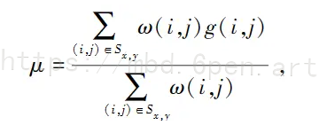
式中,ij为模板像素坐标;g(i,j)为待去噪图像对应的像素灰度值;S.,表示以( x , y)为中心像素点的范围大小为( 2n+1)×( 2n+1)的邻域;o(i,j)为每个g(i,j)像素点的加权系数,其值为o。与o,的乘积，w。为空间邻近度因子,o,为亮度相似度因子。
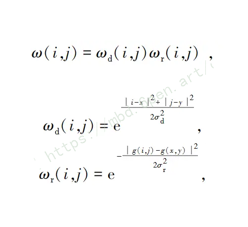
式中,σd 为 Sx,y 邻域像素相对于中心点像素的位置标准差;σr 为 Sx,y 邻域像素相对于中心点像素的亮度标准差。
为了将目标矿石与背景进行区分,通过对矿石图像进行双边滤波处理,并且使用二值化方法[4] 对其进行灰度变换,生成二值图。

# 8.矿石特征提取
根据该博客给出的代码，识别矿石的主要方法是计算出矿石在图像中的几何特征,通过测量其边界范围的周长、面积、最小外接矩形的长宽比以及圆形度来与杂物进行区分。计算图像中分割出来的矿石区域的周长,可以将区域分成n段链码,用( ai , a2 ,…, an)表示n段链码,每一段链码a,的长度用△l,表示,因此区域边界周长C的计算如下:
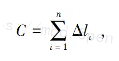
式中,n 是链码序列中链码的总个数。计算矿石区域的面积:对分割的矿石区域 x 轴积
分来获得面积 S,还可以统计该区域内的像素点的数量来衡量。
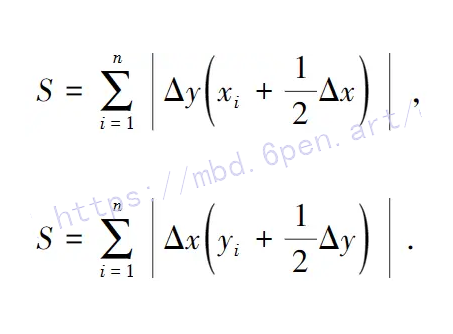
其中, x,=x;.1-△x , x,和x;,1分别是链码曲线初始点和终止点的横坐标,△x为横坐标差值;y,=y,.-△y ,y,和yi，分别是链码曲线初始点和终止点的纵坐标,△y为纵坐标差值。
圆形度e用于衡量目标与圆形的拟合程度以及刻画物体边界的复杂程度,e为1时,图形即为圆形;e越小,图形越不规律,与圆形的差距越大。定义式如下:
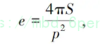
式中,S 为圆的投影面积;p 为圆的周长。最小外接矩形长宽比,包含一组点的最小封闭矩
形,计算公式如下:
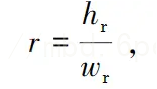
式中,r表示长宽比; w,表示最小外接矩形宽;h,表示最小外接矩形高。
通过对已经提取到的几何特征值的统计,当面积与设定的某阈值有差距时,能够自动判断此区域是否为矿石或者异物。木条形状狭长,圆形度小于某阈值且长宽比大于某阈值的区域归为狭长异物。

# 9.系统整合
下图[完整源码＆环境部署视频教程＆自定义UI界面](https://s.xiaocichang.com/s/08897c)
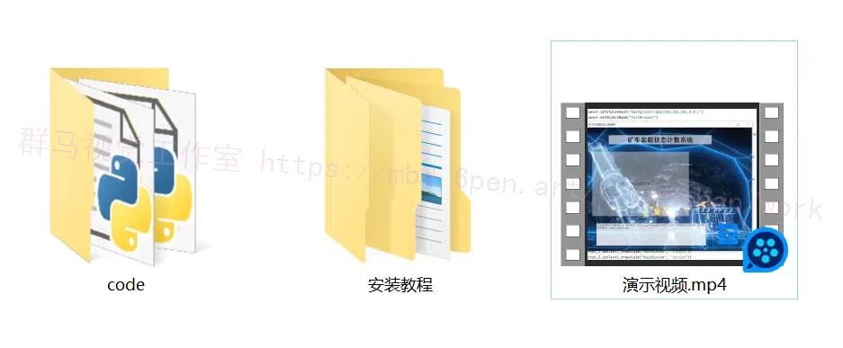

参考博客[《Python基于深度学习的矿车装载状态计数系统（部署教程和源码）》](https://mbd.pub/o/qunshan/work)

# 10.参考文献
---
[1][罗雅丽](https://s.wanfangdata.com.cn/paper?q=%E4%BD%9C%E8%80%85:%22%E7%BD%97%E9%9B%85%E4%B8%BD%22).[车牌识别中人工智能技术的应用](https://d.wanfangdata.com.cn/periodical/dnbcjqywh202107051)[J].[电脑编程技巧与维护](https://sns.wanfangdata.com.cn/perio/dnbcjqywh).2021,(7).DOI:10.3969/j.issn.1006-4052.2021.07.051.

[2][何文轩](https://s.wanfangdata.com.cn/paper?q=%E4%BD%9C%E8%80%85:%22%E4%BD%95%E6%96%87%E8%BD%A9%22),[胡健](https://s.wanfangdata.com.cn/paper?q=%E4%BD%9C%E8%80%85:%22%E8%83%A1%E5%81%A5%22),[柳小波](https://s.wanfangdata.com.cn/paper?q=%E4%BD%9C%E8%80%85:%22%E6%9F%B3%E5%B0%8F%E6%B3%A2%22),等.[矿石块度视觉识别判断方法](https://d.wanfangdata.com.cn/periodical/zgky202106017)[J].[中国矿业](https://sns.wanfangdata.com.cn/perio/zgky).2021,(6).

[3][周家振](https://s.wanfangdata.com.cn/paper?q=%E4%BD%9C%E8%80%85:%22%E5%91%A8%E5%AE%B6%E6%8C%AF%22),[杜玉晓](https://s.wanfangdata.com.cn/paper?q=%E4%BD%9C%E8%80%85:%22%E6%9D%9C%E7%8E%89%E6%99%93%22).[基于机器视觉的车牌定位与识别算法研究](https://d.wanfangdata.com.cn/periodical/dzsj202113032)[J].[电子世界](https://sns.wanfangdata.com.cn/perio/dzsj).2021,(13).58-59.

[4][吴聪](https://s.wanfangdata.com.cn/paper?q=%E4%BD%9C%E8%80%85:%22%E5%90%B4%E8%81%AA%22),[殷浩](https://s.wanfangdata.com.cn/paper?q=%E4%BD%9C%E8%80%85:%22%E6%AE%B7%E6%B5%A9%22),[黄中勇](https://s.wanfangdata.com.cn/paper?q=%E4%BD%9C%E8%80%85:%22%E9%BB%84%E4%B8%AD%E5%8B%87%22),等.[基于人工神经网络的车牌识别](https://d.wanfangdata.com.cn/periodical/wjfz201612035)[J].[计算机技术与发展](https://sns.wanfangdata.com.cn/perio/wjfz).2016,(12).DOI:10.3969/j.issn.1673-629X.2016.12.035.

[5][姒绍辉](https://s.wanfangdata.com.cn/paper?q=%E4%BD%9C%E8%80%85:%22%E5%A7%92%E7%BB%8D%E8%BE%89%22),[胡伏原](https://s.wanfangdata.com.cn/paper?q=%E4%BD%9C%E8%80%85:%22%E8%83%A1%E4%BC%8F%E5%8E%9F%22),[张伟](https://s.wanfangdata.com.cn/paper?q=%E4%BD%9C%E8%80%85:%22%E5%BC%A0%E4%BC%9F%22),等.[一种改进的双边滤波图像去噪算法](https://d.wanfangdata.com.cn/periodical/jsjgcyyy201502037)[J].[计算机工程与应用](https://sns.wanfangdata.com.cn/perio/jsjgcyyy).2015,(2).DOI:10.3778/j.issn.1002-8331.1303-0275.

[6][代勤](https://s.wanfangdata.com.cn/paper?q=%E4%BD%9C%E8%80%85:%22%E4%BB%A3%E5%8B%A4%22),[王延杰](https://s.wanfangdata.com.cn/paper?q=%E4%BD%9C%E8%80%85:%22%E7%8E%8B%E5%BB%B6%E6%9D%B0%22),[韩广良](https://s.wanfangdata.com.cn/paper?q=%E4%BD%9C%E8%80%85:%22%E9%9F%A9%E5%B9%BF%E8%89%AF%22).[基于改进Hough变换和透视变换的透视图像矫正](https://d.wanfangdata.com.cn/periodical/yjyxs201204022)[J].[液晶与显示](https://sns.wanfangdata.com.cn/perio/yjyxs).2012,(4).DOI:10.3788/YJYXS20122704.0552.

[7][裴月玲](https://s.wanfangdata.com.cn/paper?q=%E4%BD%9C%E8%80%85:%22%E8%A3%B4%E6%9C%88%E7%8E%B2%22),[张涛](https://s.wanfangdata.com.cn/paper?q=%E4%BD%9C%E8%80%85:%22%E5%BC%A0%E6%B6%9B%22).基于人工智能的车牌号与车型识别系统[J].[公路](https://sns.wanfangdata.com.cn/perio/gl).2019,(8).

[8][张柳](https://s.wanfangdata.com.cn/paper?q=%E4%BD%9C%E8%80%85:%22%E5%BC%A0%E6%9F%B3%22).[基于图像处理的矿山运输车装载状态识别的算法研究](https://d.wanfangdata.com.cn/thesis/Y3805704)[D].2020.

[9][Yuan, Zehuan](https://s.wanfangdata.com.cn/paper?q=%E4%BD%9C%E8%80%85:%22Yuan%2C%20Zehuan%22),[Lu, Tong](https://s.wanfangdata.com.cn/paper?q=%E4%BD%9C%E8%80%85:%22Lu%2C%20Tong%22),[Tan, Chew Lim](https://s.wanfangdata.com.cn/paper?q=%E4%BD%9C%E8%80%85:%22Tan%2C%20Chew%20Lim%22).[Learning discriminated and correlated patches for multi-view object detection using sparse coding](https://d.wanfangdata.com.cn/periodical/ac8c8ab9f908370c57928ccd5c44e4b9)[J].Pattern Recognition: The Journal of the Pattern Recognition Society.2017.69

[10][Zhang, G.Y.,Liu, G.Z.,Zhu, H.,Qiu, B.](https://s.wanfangdata.com.cn/paper?q=%E4%BD%9C%E8%80%85:%22Zhang%2C%20G.Y.%2CLiu%2C%20G.Z.%2CZhu%2C%20H.%2CQiu%2C%20B.%22).[Ore image thresholding using bi-neighbourhood Otsu's approach](https://d.wanfangdata.com.cn/periodical/5b5946002b98afa811c83381531a844c)[J].Electronics Letters.2010,46(25).1666-1668.


---
#### 如果您需要更详细的【源码和环境部署教程】，除了通过【系统整合】小节的链接获取之外，还可以通过邮箱以下途径获取:
#### 1.请先在GitHub上为该项目点赞（Star），编辑一封邮件，附上点赞的截图、项目的中文描述概述（About）以及您的用途需求，发送到我们的邮箱
#### sharecode@yeah.net
#### 2.我们收到邮件后会定期根据邮件的接收顺序将【完整源码和环境部署教程】发送到您的邮箱。
#### 【免责声明】本文来源于用户投稿，如果侵犯任何第三方的合法权益，可通过邮箱联系删除。